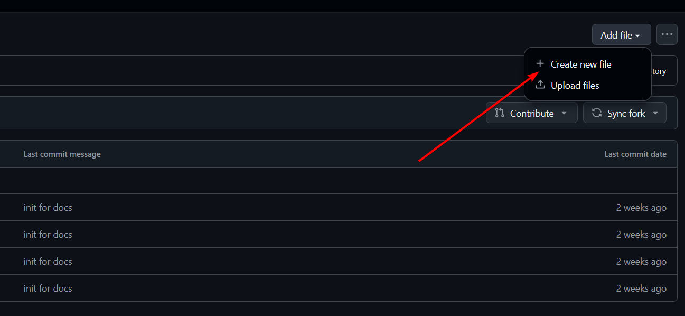
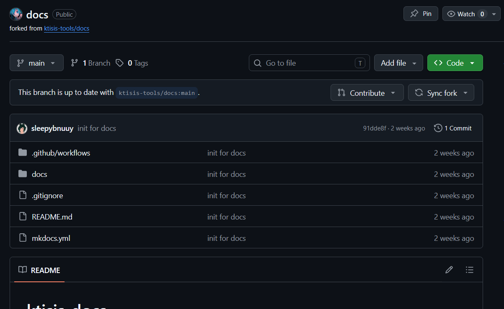

# Contributing to the Ktisis Wiki

A prerequisite for this guide is that you have a github account, if you dont please sign up [here](https://github.com/signup).
**Note** this page is under construction, and will be rough around the edges, but will serve as a good starting point.

## Getting started

If this is the first time you've ever edited the wiki, go and [fork](https://github.com/ktisis-tools/docs/fork) the repository, the default settings are fine you can just click the green button that says 'Create Fork'.

This will bring you to your own copy of the docs, which you are now free to mess with. I'll give a brief overview on how to use the github web editor below.

## Editing the wiki

If you cant find your copy of the wiki, click on the user icon in the top right corner of github and hit 'Repositories', then find the one that says docs, that should be your copy. You'll be greated like the screen below if you did it right:

From here, you can open the docs folder where all of your work will take place, you can either open a page to edit, or add a new file on the top right hand side.

All of the files you'll make by hand will end in the .md format, you can find out more about markdown in the [markdown guide](https://www.markdownguide.org/basic-syntax/).

If you're using the web editor, a few things to note: 

-   You have to commit your changes before leaving the page, otherwise your work will be lost.
-   You can drag and drop an image file directly on to the editor and it will upload and embed it for you.
-   Its mainly good for quick edits, but if you dont want to go all in on setting up a workspace, it works well enough.
-   You can and should check the Preview thats offered, it wont be 1:1 but it will give a good enough idea of what your page formatting will look like.

## Contributing back to the docs

The easiest way to do this is on your fork click the button that says 'Contribute' then open a pull request (whats sometimes known as a PR).
Give a brief description of what you did and why you want it added, then it will be reviewed and either merged, or we might ask you to make some edits before merging.

## Setting up a more permanent workspace

While the github web editor is okay, its far from ideal for most situations, you can also use an editor like [Visual Studio Code](https://code.visualstudio.com/download) to copy your work locally, and edit on your own PC.
I'll update this doc with a more indepth guide on how to pull from VS Code and spin up your own mkdocs server to see your changes locally with full accuracy, but this should get you started.
