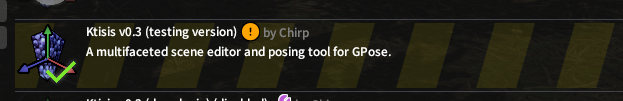
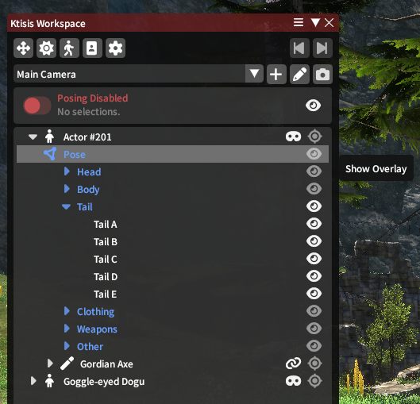
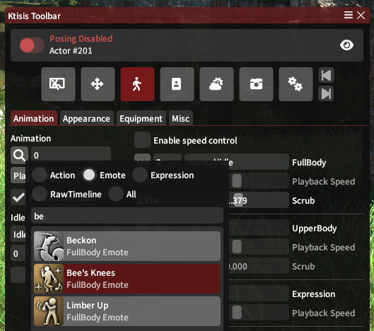

# Frequently Asked Questions

## How do I install Ktisis v0.3?
Currently, v0.3 is available as the Testing build of Ktisis in Dalamud. What this means is that when you install Ktisis (either from our repository or the Sea of Stars link), you're defaulted to the Main build, which has the v0.2/Alpha version until v0.3 is fully released. In order to switch to v0.3:

1. Type `/xlsettings` to open Dalamud's settings window; select **Experimental** and enable **Get plugin testing builds**.
2. Type `/xlplugins` to open Dalamud's plugin installer. If Ktisis is already installed, right-click it and select **Receive plugin testing versions**. If not, this can be done from the list of available plugins.
3. **Update plugins**, and an uninstall/reinstall of Ktisis may be necessary. Restart FFXIV and reinstall Ktisis if the update doesn't come through, or contact us for help with any issues.
{ align=right width=500 }
4. After verifying that v0.3 was installed, enter GPose to initialize Ktisis. Errors may occur if Ktisis' settings are opened before an initial GPose.

## This is overwhelming! Where do I start?
If you're coming to Ktisis as a new user, welcome! This wiki is the perfect place to learn about what Ktisis can do - check out our [guides](./guides.md) for beginner and advanced tips, search for specific questions at the top of the page, or join our [Discord server](https://discord.gg/kUG3W8B8Ny) for any support that you can't find here.

If you're revisiting Ktisis after having used the v0.2 or Alpha version, check out our [migration guide](./migration.md) to find out everything that's changed and how you can tailor your experience.

## Why can't I see any bones on my character?
Bone overlay visibility is disabled by default so you can see your character as they would appear for screenshots.

{ align=left width=200 }
When you need to see bones to move them around in 3D space, use the Workspace's dropdowns on each actor to find and enable any (or all) parts of the skeleton.

You can also use default or custom **Presets** to toggle groups of bones on and off, found either by right-clicking specific actors or in the Object Editor.

## How do I play different emotes or animations?
The Actor Editor! In addition to changing your character's appearance, this is where you apply any combinations of emotes and expressions. You can also set specific cposes, sitting & lying down, and whether their weapon is drawn.

You can open this window from the top of the Workspace or Toolbar, or from any actor's right-click menu.

{ width=400 }
/// caption
Searching for animations shown in the Toolbar UI.
///

## Where do I send bug reports or feature requests?
You can raise any issues, suggestions, or get support from the devs & community in [our Discord](https://discord.gg/kUG3W8B8Ny). We also accept new issues and PRs [on GitHub](https://github.com/ktisis-tools/Ktisis/issues) if you're handy using it!
