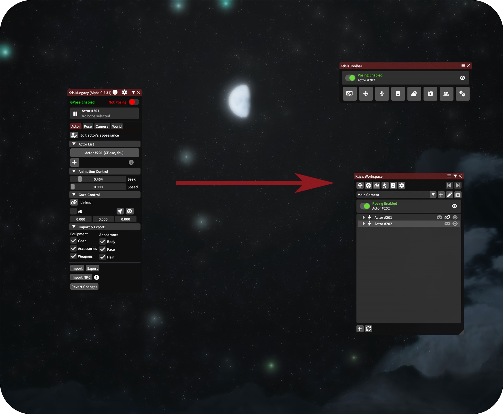

# v0.2 to v0.3

## Why Are We Updating?

Ktisis has been in development since **2022**, and a lot has changed with Dalamud and other plugins since then. Ktisis v0.3 has been a work-in-progress since 2023, acting as a more stable foundation for our new features and the primary focus of the current development team. New tools, skills, and resources are needed to deliver a great plugin. We're committed to providing a lightweight and accessible posing tool for users new & old of all skill levels, and the release of v0.3 is the latest evolution of that goal.

### Why v0.3? What about v0.2?

Despite being the 'main' version of the plugin, v0.2 is wildly out of date in terms of best practices for sane plugin development _and_ for enhancements built on v0.3. The difference between versions has been one of the primary drivers for updates made to v0.3 over the last several months: bringing older features and conveniences into a new and stable interface that we can build on going forward. Features like Gaze Control, Bone Offsets, and Work Camera Speeds were all missing from v0.3 until recently - and v0.2 is missing many more features and stability fixes that were built into v0.3. As a result, v0.3 is now a more stable, more featured, and more extensible platform for us to create new content upon and follow the best practices of Dalamud development. Developing **both** versions in parallel has proved impossible for our small dev team, and more confusing than its worth for our userbase.

{ width=600 }
/// caption
New looks, same great flavor!
///

After consulting with our users for a number of important changes to ease this migration, we hope to provide a better experience to more players by focusing our efforts into one product. Thank you for your trust and your patience!

## What's New?

### Ktisis Toolbar
If you're migrating from v0.2 (otherwise why would you be reading this?), you may find the Ktisis Toolbar more comfortable for your workflow: it condenses multiple windows in to one central window, reminescent of v0.2's layout. This is an alternative UX for those who prefer a more compact interface or who may find the variety of new editors overwhelming. You can enable the Toolbar as the first option in the General settings window.

### Environment Editor
The Environment Editor has been expanded significantly to include more in-depth Sky editing (now including skybox preview images and cloud-cover controls), Ambient Lighting, Fog, Rain and all other particle effects, Stars, Wind, Water, and even Housing lighting control. We encourage you to play with the new possibilities when building a scene!

### Advanced Lighting
v0.3 offers granular control over nearly all aspects of light sources in your scene. Lights spawned from the vanilla GPose menu, or any number created from the Workspace, can then be modified in the Object Editor to adjust anything about them: color, distance, shadows, shape and size and more.

### Inverse Kinematics
v0.3 has added [Inverse Kinematics](https://en.wikipedia.org/wiki/Inverse_kinematics) for controlling your arms, legs, tail and even genitals (if applicable), offering a shortcut to posing long chains of bones. When using IK, you only need to position an actor's hands or feet - Ktisis will do the hard work of bending their legs and arms without stretching or warping unnaturally.

### Actor Spawning & Multi Posing
You can now spawn over 40 actors - as a clones of your PC, from an NPC, using an MCDF or Chara file, or even replaced with minions or used for props. You can also pose bones from multiple actors at the same time! Bone overlay visibility is no longer dependent on having specific actors selected, and you can simply click from a bone on one skeleton to another with no hassle.

### Animation Controls
Ktisis now features full animation control, allowing you to select individual face, body, or lip animations. These can be played, slowed down, or scrubbed frame-by-frame by searching for complete emotes/actions, or making individual choices per-body part. To simplify expressions post-Dawntrail, vanilla face emotes can also be applied in the Animation menu while the character is frozen in Pose Mode.

### Plugin Compatibility
Penumbra, Glamourer, and Customize+ are now fully supported with easy to use options to apply settings from your Profiles/Collections/Glamourer designs. Appearances can be safely edited using outside plugins without fear, and MCDF files can be loaded in too. Integration with Penumbra allows for fun possibilities, such as turning an actor's skin invisible to pose only their gear and weapons.

### And More!
- Anamnesis-like Pose View
- Pose flipping
- Multi-selecting bones + new mirror modes
- MCDF/PCP support
- Expanded camera controls
- 2D Gizmo
- Attachment system
- New personalizations

## What's Changed from v0.2?

### Actor Tab

- Actor List
    - This is now housed in the Workspace window, where many other actions take place. The Workspace will be your primary window for interacting with actors and opening other editors.
    - Actors can be added using the :fontawesome-solid-plus: button at the bottom left of the Ktisis Workspace and selecting 'Create new actor'. This subverts the need to spawn Carbuncles or transform Minions into humans for multiple-actor poses.
- Animation Control and Appearance Editing
    - Animation, appearance, and equipment edits can all be found in a single Actor Editor window - this can be opened from the top of the Workspace, by middle clicking any actor, or by right clicking and selecting 'Edit Appearance.'
- Gaze Control
    - Gaze controls have been expanded and added to the Object Editor, which can be opened from the Workspace, and are now found under the dropdown 'Advanced (Gaze/IK)'.
- Import & Export
    - These controls have also moved to the right click context menu: right click the actor you want to modify, then you can import a 'Character (.chara)' or NPC, and via the export menu a 'Character (.chara)' file. Export and Import buttons can also be found in the Object Editor's Actor tab.

### Pose Tab

- Transform Editor
    - This is now baked into the Object Editor, click on the actor you want to manipulate to get there.
- Bone Categories & Bone List
    - These have been combined and placed into the Workspace window. To see the overlay of bones for a particular character, expand the tree and click the eye icon to the left of Pose.
    - You can toggle particular categories of bones on and off in the same way; expanding the list down to individual bones allows you to toggle them individually, too.
    - To change bone visibility without needing to navigate the Workspace, Presets are available in right click menus and the Object Editor. These come pre-loaded with groups such as Limbs, Head & Hair, Torso, etc. Presets can be customized to include any bones you want, and their overlays can be toggled with a single click.
- Import & Export
    - You can Import or Export a pose using the same Actor right click menu mentioned above, or in the Object Editor inside the 'Pose' dropdown.
- Advanced (Debug)
    - Most of these features have been carried over under the Object Editor's Pose dropdown.

### Camera Tab

- Add Camera, Work Camera, and Camera Select
    - These can now be accessed in the main Ktisis Workspace below the top row of buttons.
- Camera Editor
    - Beside the Add and Work Camera buttons is the :fontawesome-solid-pencil: button to open the Camera Editor - here, you can make all expected changes to custom cameras (collision, zoom, rotation and position, etc).

### World Tab

- The World tab has been replaced with the much more robust Environment Editor, accessed by the :fontawesome-solid-sun: button.

### Options

Keep in mind that not all settings will have a direct replacement, since v0.3 was rebuilt from the ground up.

- Interface
    - Open Ktisis: Ktisis now automatically opens when you open GPose.
    - Hide character name: is now under General :fontawesome-solid-arrow-right: Incognito Mode
    - Censor NSFW: the default is to censor NSFW bones, and can be toggled under General :fontawesome-solid-arrow-right: Display NSFW bones
- Overlay
    - Bone and Category Colors are sorted under Personalize
    - Skeleton Lines and Dots customization have moved to Personalize :fontawesome-solid-arrow-right: Overlay
    - Edit Bone Positions moved to Personalize :fontawesome-solid-arrow-right: Bone Offsets. Offsets can be imported from the clipboard in the v0.2 format or v0.3 format.
- Input
    - Now called Inputs. Additional categories have been added for more convenient and time-saving hotkeys that can be configured in each Inputs menu.
- Camera
    - All settings are now under Inputs :fontawesome-solid-arrow-right: Camera
- AutoSave
    - Now under General :fontawesome-solid-arrow-right: Auto Save
- References
    - Reference Images can now be added using the Workspace :fontawesome-solid-plus: menu, rather than through the Settings window.
