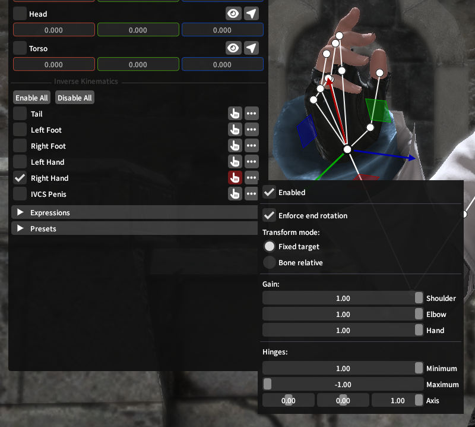
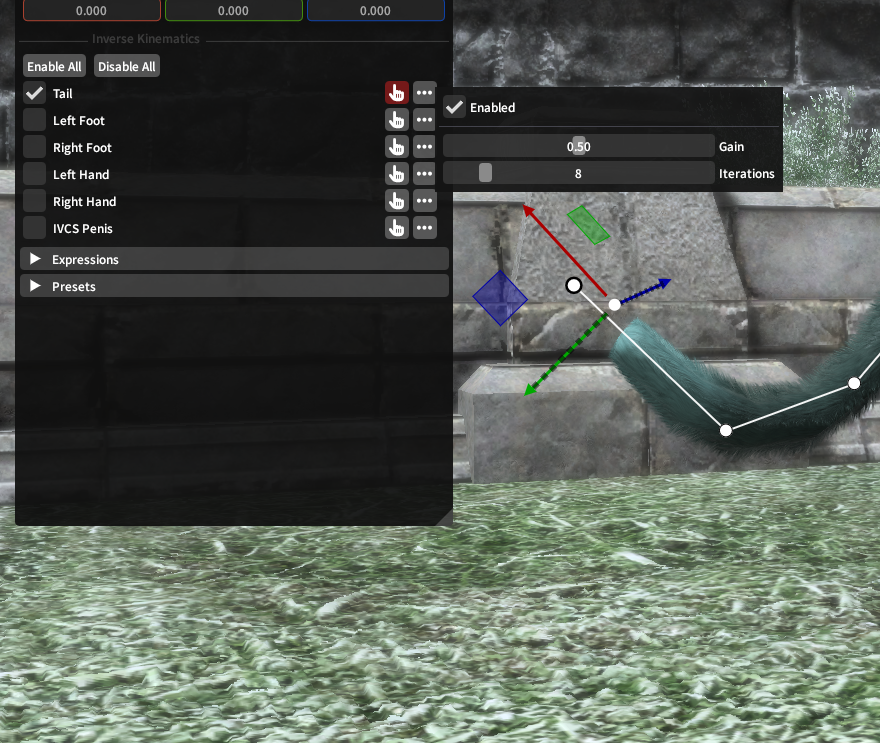
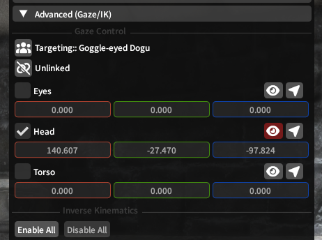
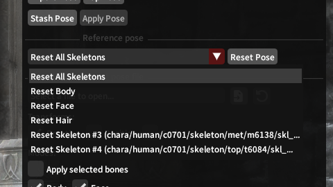
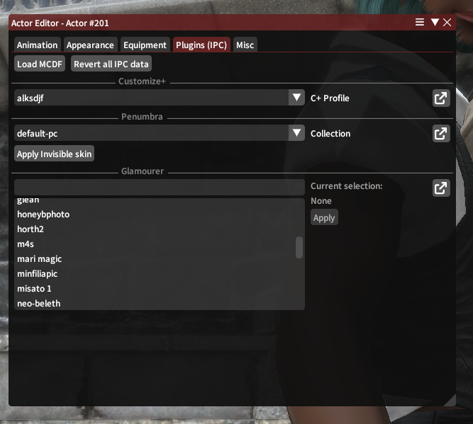

# Advanced Topics

## Inverse Kinematics (IK)
[Inverse Kinematics](https://en.wikipedia.org/wiki/Inverse_kinematics) controls are offered by Ktisis for use in manipulating actors' limbs while in and out of Pose Mode. Put simply, IK operations use a lot of complex math behind the scenes to make it easier to manipulate chains of bones in a way that looks natural to how those bones actually move in real life.

You'll be familiar with why this could be useful if you've ever had to fix an elbow or shoulder bone being completely twisted inside-out after putting an actor's hand in the right place. Using IKs in Ktisis will let you just move the hand, while the elbow, shoulder, and arm bones each adjust themselves automatically based on its final position.

### Two-Joint (Limbs)
{ align=left width=400 }

Arms and legs are controlled using Two-Joint IK, which offers control over all 3 hinges (shoulder/thigh, elbow/knee, and hand/foot) along the limb.

By default when enabled, **Fixed Target** and **Enforce End Rotation** will be turned on, meaning you can drag the hand or foot anywhere in space using the translation gizmo, such that the hand/foot will remain pointed the same direction while the elbow and shoulder rotate and bend to accomodate its placement.

**Gain** sliders for Shoulder, Elbow, and Hand each control how much influence the IK solver will have on these hinges when trying to reach the target point. For example: if elbow is set to 0 while the hand is outstretched in front of the character, the shoulder joint will twist farther forwards to reach the anchored position of the hand, since the elbow can't bend to do so itself.

**Bone Relative** IK is also available - when this transform mode is chosen, the gizmo no longer determines the target point for the hand and arm to aim towards. Instead, the rotations and flexing of each joint are driven purely by the gain and hinge sliders, letting you make an angle for the arm from scratch using only the IK system.

### CCD (Chains)
{ align=right width=400 }

Tails and _male genitalia_ are controlled using CCD IK with much simpler options - CCD can be thought of as treating a tail like a long rope, with the gizmo being used to pull the end of the rope towards one end in space (while the other end remains anchored to the player's body).

The **Gain** slider represents the tension pulling the chain of bones towards its target, where more gain will make a straighter, less-drooping line.

**Iterations** determines how many times the IK solver will try to manipulate the bones to reach the target point - if gain is set to 1, this will have little effect, as the target will almost always be reached as stiffly as possible on the first try. If the gain is set lower, this allows you to create a more natural curve towards a target.

## Gaze Control
Outside of Pose Mode, Ktisis uses XIV's LookAt system to help control where actors are looking while animations play. Vanilla GPose has a button to turn actors' heads towards the camera and an option to have eyes follow the camera, but Ktisis expands these for more granular control.

{ width=400 }
/// caption
///

Individual controls for Eyes, Head, and Torso are available - when enabled, each of these uses the position set on its transform sliders to determine where to turn towards. To make these simpler to set, the :fontawesome-solid-eye: button sets the target position to the camera's location, and the :fontawesome-solid-location-arrow: button activates a gizmo used to drag the target wherever you please.

Each part of the body can be directed to look at different locations individually, or you can use the **Linked/Unlinked** button to swap and set all 3's target at once. Another actor in the scene can also be set as a target, making the chosen actor look towards them whenever Ktisis' overrides are not active for their own locations.

## Reference Poses
If you've ever loaded a gear piece or XIV model in Blender or TexTools, you know that un-posed actors in XIV default to an **A-Pose** when not animated - this is the reference (or resting) pose for the player skeleton. Every skeleton has a reference pose - its default orientation for each bone - and player characters are actually made up of multiple skeletons at once:

- the fullbody skeleton, which includes most of the bones used for posing: arms and legs, torso, tail, even the head and basic hair bones too
- the face skeleton, which is parented to the fullbody skeleton's head bone and includes all the DT (or legacy pre-DT) face bones
- the hair skeleton, containing `_ex_` bones used for the player's current hairstyle
- plus optional extra skeletons with more `_ex_` bones, often used for long sleeves/scarves on chest gear or visors and dongles on head gear

{ align=right width=400 }

Ktisis can reset any of these skeletons individually, or all of them together, to their reference pose in one click from the Object Editor.

This can be useful for making a pose completely from scratch by discarding the actor's current animated state, or for resetting a specific skeleton while keeping others posed - the body can be reset while the face keeps an expression, or hair bones can be reset if they've gone off-kilter. If something goes wrong with an extra skeleton, try setting it back to reference pose and working from the start!

## Attachables
Ktisis takes advantage of XIV's Attachment system to allow for manipulating objects that attach onto others. In vanilla, this includes weapons and players (when mounted), and is represented in Ktisis with the :fontawesome-solid-link: icon.

Anything already attached can be reset to its original target (by clicking the chain icon) or instead have its attachment point changed by clicking and dragging the entry in the Workspace onto a different target. Attachable entities without a link can be given one in the same fashion, which may be useful for gluing minions or props onto specific bones.

_Entities which can be attached_: player/npc actors, weapons, and lights

_Attachment targets_: any bones on any actor

## IPCs
IPCs (inter-plugin communications) are used by Ktisis to reach out to other popular plugins and integrate our features with their own. These can open up some new possibilities for posing and setting up your actors, and can be used from the actors' right-click menu or in the Actor Editor:

{ align=left width=400 }

### MCDFs
Ktisis supports loading **MCDF** files packed by the Mare Synchronos sync service and its modern forks (Lightless, Snowcloak, Laci, et cetera) - applying one of these will overwrite the actor's Penumbra, Glamourer, and Customize+ data all at once to the saved appearance of the modded character contained in the .mcdf package. These changes (and any others made below) can be undone with the **Revert all IPC Data** button.

### PCPs
**PCP** files are packaged by Penumbra's On-Screen view as another way of capturing your character's appearance to share with others. While Ktisis does not support importing .pcp files itself, if one is imported to Penumbra, the respective components in Penumbra, C+, and Glamourer can each be set using the selectors offered in the IPC menu.

### Customize+
Profiles can be set for each actor from those available in C+, letting you temporarily set a new scaling for anyone in your scene without disturbing their out-of-GPose appearance.

### Penumbra
Mod collections can be swapped for each actor without needing to open Penumbra manually - this can be useful to change the associated collection for an arbitrary actor (such as making a minion Actor 202 use a collection that swaps it to a specific modded item) or switch a player's to a specific setup. Collection assignment changes made here **will** persist outside of GPose.

**Invisible Skin** is also offered as a convenience tool - [these mods](https://heliosphere.app/mod/3pcpdbbn290v57b3bdry6y0p08) are commonly used as a GPosing tool to apply to a duplicated actor and hide their skin & hair textures, so that the equipment on the actor is the only thing visible. This can be useful for posing clothing or hats that can't otherwise be removed from a normal actor - just use invisible skin on a new actor, and place the invisible body+visible clothes anywhere you like!

### Glamourer
Ktisis will list all available Designs from Glamourer and can apply them to the targeted actor in one go. Designs are commonly used to preserve a library of different looks or appearances for your OCs, allowing you to reload them for posing in one button press rather than fumbling in either tool's equipment view to set them up just right.
