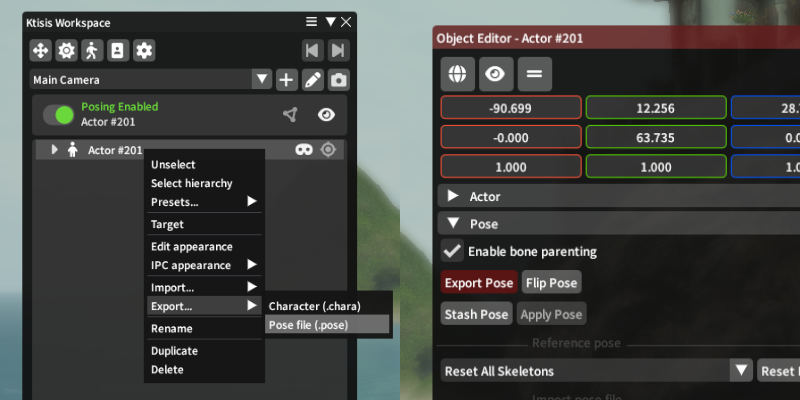
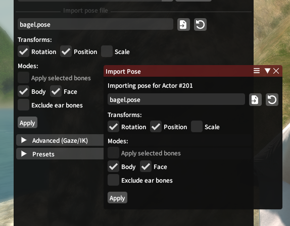

# Importing & Exporting

Pose files exist to load the state of an actor's skeleton for later use; they typically include only data on the actor's bones, not their appearance or equipment (which are controlled by .chara or [.mcdf](./advanced.md#ipcs) files). Ktisis can author and read these files for itself or for other posing tools. Pose files are commonly shared on sites like XIVModArchive or traded between players for collaborations.

## Pose Export

Sharing a pose from Ktisis to others is as simple as saving it to a `.pose` file. This can be done from two locations:

- Opening an Actor's dropdown menu from the Workspace with right-click, then navigating to `Export > Pose file (.pose)`
- Opening the Object Editor for an Actor, then clicking the `Export Pose` button in the `Pose` dropdown

{ width=600 }
/// caption
///

This will open a dialog to save a `.pose` file somewhere on your computer, either to reuse for yourself or share with others. No additional options are necessary here - the entirety of the chosen actor's pose is saved out to one file, so that different options can be used with it when later _importing._

## Pose Import

Importing `.pose` files involves a variety of other options, controlled by an import widget in either the Object Editor > Pose tab or the standalone import window.

{ width=600 }
/// caption
///

Once a pose file (or legacy `.cmp` file) has been chosen, you'll be able to change the following settings to determine how the pose will be applied to the selected actor.

### Transforms

**Position**, **Rotation**, and **Scale** for each bone in the loaded pose can be individually enabled or disabled.

- **Scale** is often excluded as it may include race or Customize+ specific data that you wouldn't want to paste onto every actor, but can sometimes be important for exaggerated poses or when certain props and gear are involved
- **Position** was similarly excluded prior to Dawntrail, but has become very important for _Face_ poses and for fine tuning on the rest of the _Body_ pose. This captures each bone's position in space relative to the rest of the pose.
- **Rotation** is almost always enabled - much of the edits made to poses are based primarily off of rotating and changing the angles of different bones in the actor's skeleton.

### Modes

Two primary modes to keep in mind are _Body_ and _Face_: these control whether to load from the pose file for the actor's main skeleton and for their face skeleton respectively.

If only _Body_ is enabled, data from bones belonging to the _Face_ skeleton will be completely ignored, leaving your actor's expression intact and moving only the head bone that they're parented to. If only _Face_ is enabled, this allows you to exclusively import a facial expression and change no other bones in the skeleton. _Face_ imports can be useful for loading premade expressions onto other poses, and _Body_ imports are primarily useful for getting the actor entirely into place.

???+ warning "On Loading Expressions:"
    Prior to the release of FFXIV Dawntrail, the skeletons for player faces were much simpler; containing fewer bones and being most-often posed exclusively using Rotation values. Square Enix added many more face bones in this expansion, allowing for more expressive and complex faces which now differ wildly between each race and gender.

    If you're loading a facial expression from a different race+gender than your targeted actor, errors or visual inconsistencies may often appear. You can adjust these using position and rotation controls, but often it may be easier to work from a vanilla expression tailored for your race's face.

An option to _Exclude ear bones_ is also available, which skips ear-related data that may often be mangled between races or ear types.

Finally, if you have any bones selected from the Overlay or Workspace, checking _Apply selected bones_ brings you into our selective-import logic:

- _Anchor group positions_ can be enabled, if **Position** is being used, to improve the output locations for bones like hair and faces
- _Include descendants_ controls whether or not to update bones that are children of the selected bones; such as having Right Hand selected, and wanting to update each bone of the 5 fingers that are children of that bone.
    - _Body_ and _Face_ settings are also made visible when this is on, letting you choose whether to include bones from each skeleton in the descendant logic

### Caveats

- Poses may not always load exactly how they look in their preview images; this can be because of race/gender-specific differences, Customize+ data used in the authoring of said poses, or differences (possibly from outright bugs) with Ktisis' import processing compared to the tool used to create them
- Poses may load improperly if [Inverse Kinematics](./advanced.md#inverse-kinematics-ik) are enabled on the targeted actor. IK should be disabled before loading any pose data
- Ktisis will warn you if an incompatibility between face skeletons is detected - this can occur when trying to load a pre-Dawntrail face pose onto a post-Dawntrail skeleton or vice versa
