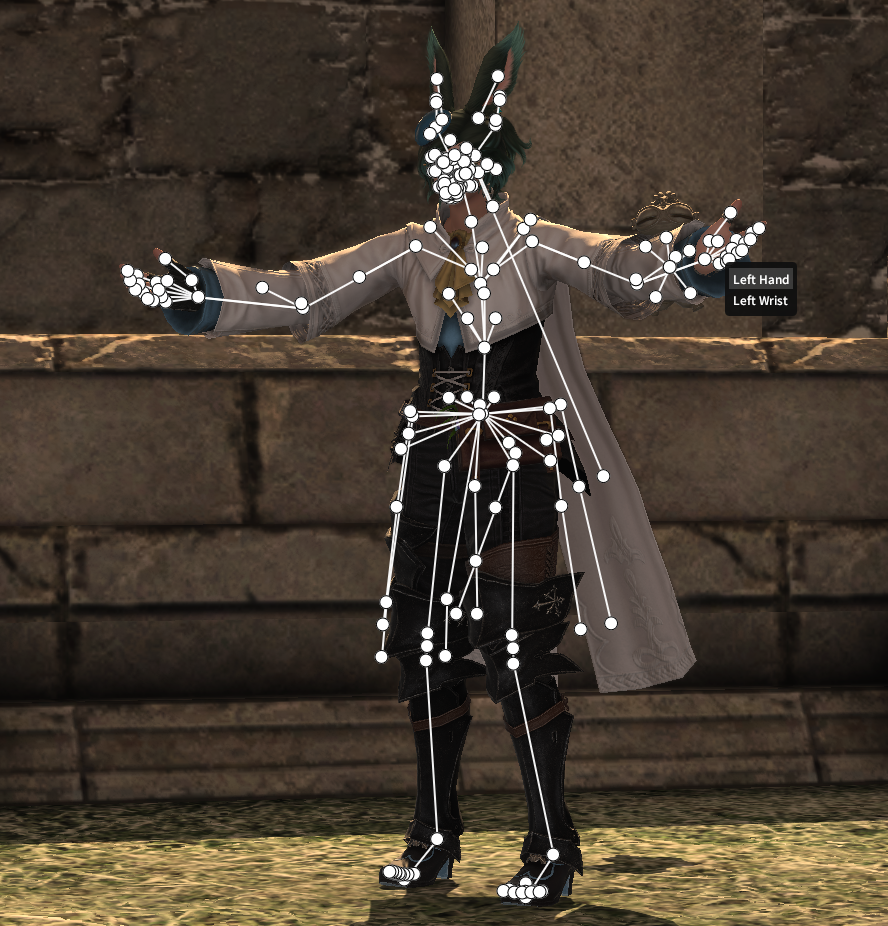
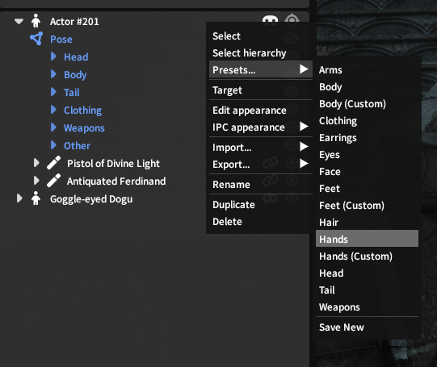
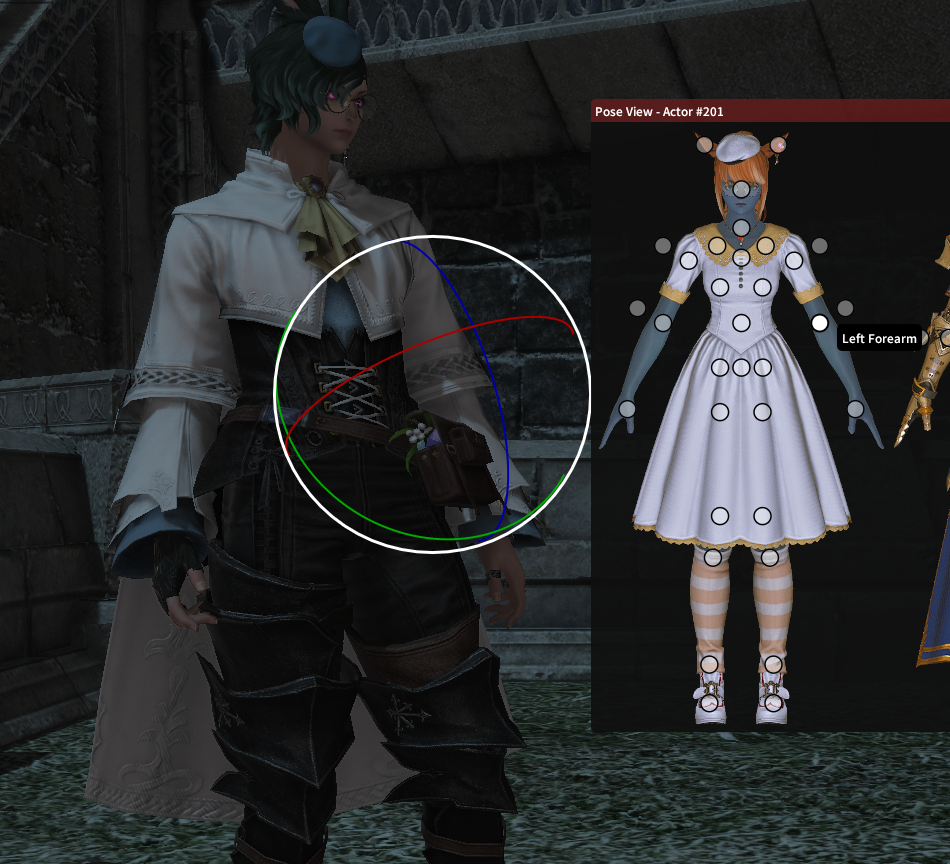
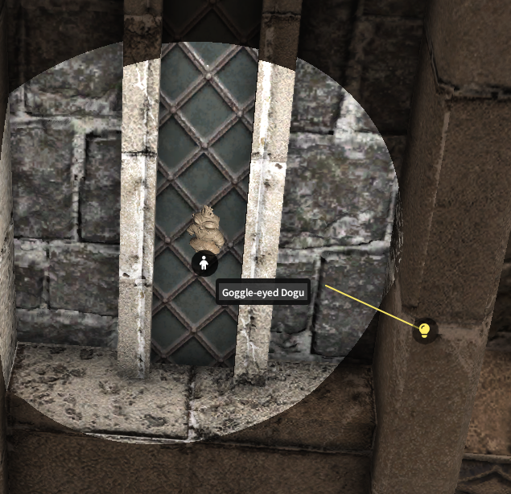
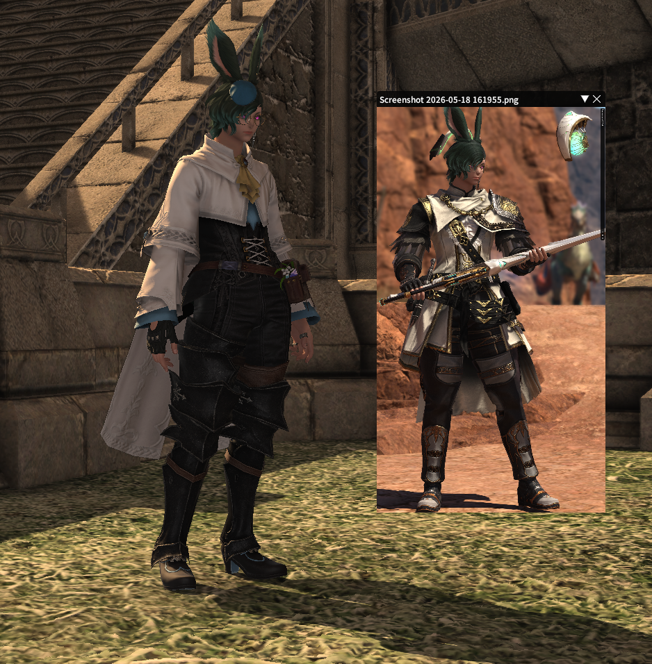

# Overlay

To make it easy to adjust elements of your GPose scene, Ktisis draws an _overlay_ above the game to provide extra detail. You'll commonly make use of the overlay to grab specific bones, actors, or light sources to place them where they belong for a screenshot.

{ width=500 }
/// caption
oof ouch my bones
///

## Showing the Overlay
The simplest method of making the overlay visible is with the **Show All Bones** :fontawesome-solid-circle-nodes: button at the top of the main window. This will override any existing visibility and force every bone in the scene to be drawn, letting you quickly find a specific bone drawn over the actor without needing to search any menus.

Bones can otherwise be made visible in four ways:

- **Presets** are made available by default and hold groups of bones that can be shown with one click. Open the Presets list by right-clicking an Actor in the Workspace, or by opening that section in the Object Editor
{ align=right width=400 }
- Open an actor's dropdown in the Workspace tree: this contains a **Pose** entry, whose **Show Skeleton** :fontawesome-solid-eye: button turns on visibility for all of that actor's bones
- Groups of bones can be turned on the same as entire poses - open the relevant dropdowns and find the category you'd like to enable (ala Hair, Face, Cheeks, Left Leg) and use the **Show Bones** :fontawesome-solid-eye: button to show all bones in that category
- Individual bones are shown as above; any bone in a category in the Workspace can be shown or hidden by itself with its **Show Bone** :fontawesome-solid-eye: button

For a 2D representation of bones instead of the 3D overlay, you can use the **Pose View** window to choose bones, though not all are included in these displays.

{ width=400 }
/// caption
Selecting the Left Forearm bone from the Pose View paperdoll
///

## Customization
The following settings are available to personalize how your overlay is displayed to improve visual clarity:

- Categories of bones can be recolored in both the Workspace (_Group_) and Overlay (_Bone_) views - these can share the same colors or different ones, and customizing them allows you to make sections of the body visually distinct from one another
- Bone dots and lines in the overlay can have their thickness and transparency changed, or can be made invisible while manipulating to more clearly see the actor underneath
- **Bone Offsets** can be manually defined or pasted from your clipboard. Offsets are used to shift the 3D location where bones appear on the actor's model, making it easier to select those that closely overlap on the skeleton like the densely-packed face bones or custom skeleton bones. A commonly-shared collection of offsets made for Ktisis v0.2 and usable in v0.3 can be found [here](https://docs.google.com/document/d/1zDBf_MGi88GcZHTznVgJZkvJG7CKBTaKOMKO8WAUNzo/)
- The Pose View paperdoll can be customized to match your own OC using our [template images](https://github.com/ktisis-tools/Ktisis/tree/v0.3/main/Ktisis/Data/Images/Templates)

## Non-Bone Overlays
Other parts of the scene can also be shown in the overlay:

{ align=right width=400 }

- **Roots** for actors and lights, which show their overall position in the world. These can be clicked and manipulated like individual bones. For light sources, if they point in a specific direction, a projected line will also be drawn to indicate which way they're facing. Enable a root's visibility with the :fontawesome-solid-location-crosshairs: icon in the Workspace.
- **Reference Images** can be loaded from your PC's photos, creating a miniature window with transparency settings to use in matching a pose.

{ width=400 }
/// caption
///
