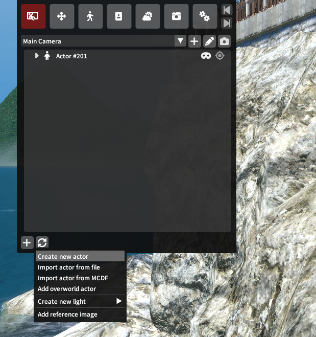
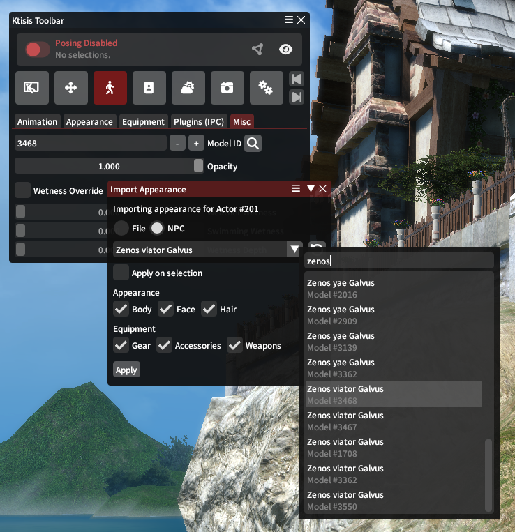

# Actor Management

GPose scenes are made up of *Actors*, which are the in-GPose copies of players and NPCs that GPose lets you take photos of. Posing tools edit these actors separately from their main-game counterparts, and Ktisis includes a number of ways to set up these actors that improves on the vanilla experience.

## Actor Creation

Once upon a time, players had to switch to Summoner and spawn a Ruby Carbuncle, turn it into a human, and load another actor's appearance just to pose with other players and NPCs.

{ align=right width=400 }

**No longer!** With Ktisis v0.4, you can spawn **over 200** extra actors to pose with by clicking to `Create new actor` in the Workspace window. Any new actors will by default copy the appearance of your player character, but these can be edited however you wish (see below!).

Besides spawning new actors this way, you can also grab anyone that's outside your GPose scene using the _Add overworld actor_ button. This displays a named list of options, from NPCs to Players and Minions, so you can click and add any to either pose them as primary actors or in the background of your picture.

???+ info "Posing Other Players"
    Other players can sometimes be included in GPose automatically, depending on if they're in your Friends List, your party, part of a duty that you're in together, etc.

    Ktisis can pose _any_ players outside of these conditions, so be respectful and responsible!

## Actor Editing

If you've created or copied an actor, they might not always look exactly how you want them to. Your romantic GPose with Zenos yae Galvus doesn't look quite right if it's just two copies of your WoL holding hands. You can change the appearances of Ktisis' actors in a few different ways:

{ align=left width=400 }

- `.chara` files [can be loaded](./actors.md#loading-an-appearance), which contain an actor's current gear, dyes, hair, and racial customizations
- the `Appearance` and `Equipment` tabs of the `Actor Editor` let you manually change gear and racial details on each actor
- NPCs can be loaded directly from XIV's data, including humanoid NPCs and non-humans like monsters (or Zenos)
- individual Model IDs can be set directly from the `Actor Editor > Misc` tab, letting you browse all of the non-human options (including some VFX!)
- external plugins such as [Glamourer](../posing/advanced.md#glamourer) are supported to load new looks over Ktisis' spawned actors

**Animations** or idle poses can also be played, paused, and blended from the `Actor Editor > Animation` tab!

## Import and Export

### Saving an Appearance

Sharing a customized or vanilla appearance from Ktisis to others can be done by saving to a `.chara` file, which can be created from two places:

- Opening an Actor's dropdown menu from the Workspace with right-click, then navigating to `Export > Character (.chara)`
- Opening the Object Editor for an Actor, then clicking the `Export Chara` button in the `Actor` dropdown

### Loading an Appearance

`.chara` files are the primary way to share a character's appearance and gear for reuse in GPosing, and these can be imported from the `Import actor appearance` section of the Object Editor's `Actor` dropdown or the accompanying right-click menu from the Workspace.

This import widget gives you the option to skip or include the body, face, and hair details for the chosen `.chara`, and the ability to ignore or exclusively import the gearset components in the file (equipment, accessories, and weapons).

**Glamourer** is also able to replace the actor's appearance using [Designs](../posing/advanced.md#glamourer), which are also supported through [PCP files](../posing/advanced.md#pcps) and [MCDF files](../posing/advanced.md#mcdfs) (the most common way today that modded appearances are shared with others). Ktisis can't create these files itself, but they can be imported from the actor's right-click menus or from the IPC tab of the Actor Editor.
