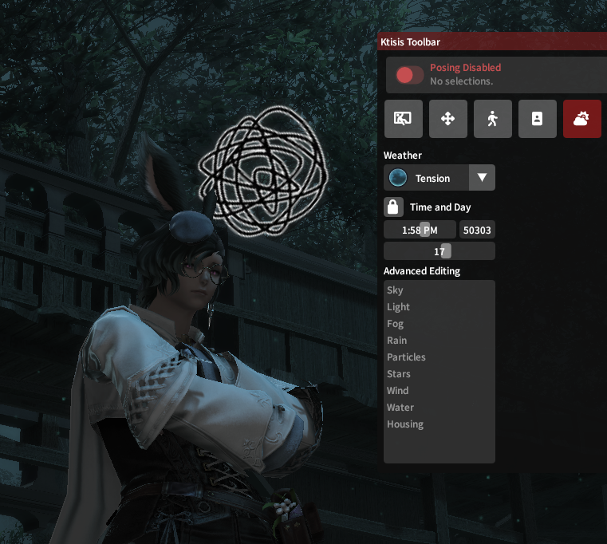
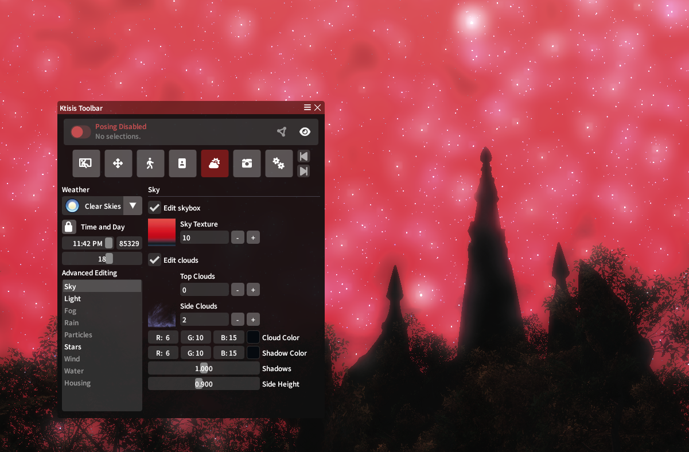
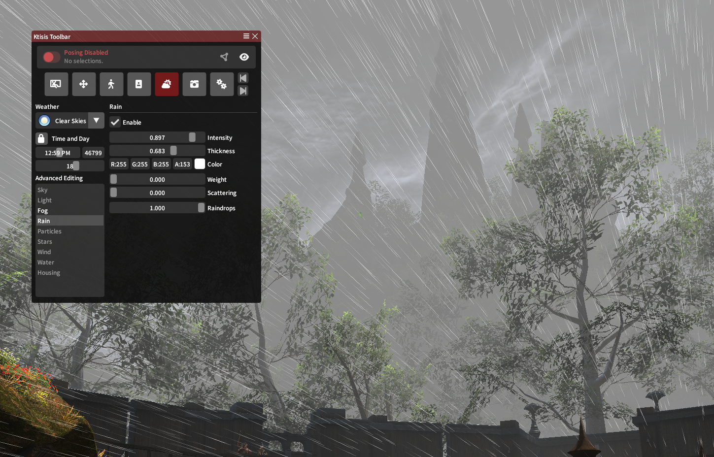
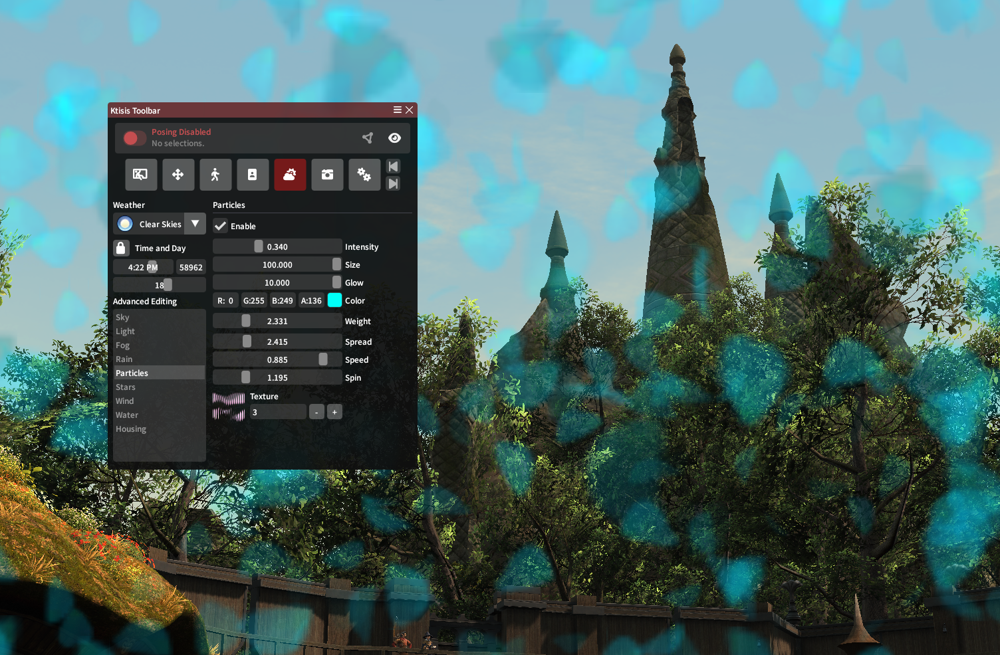
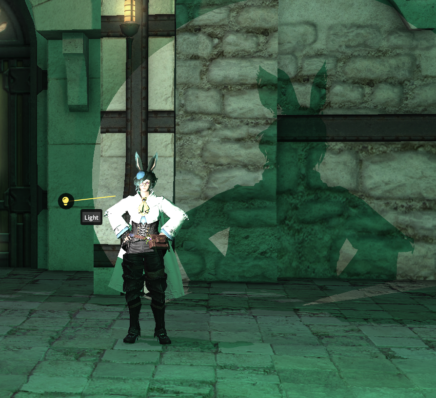
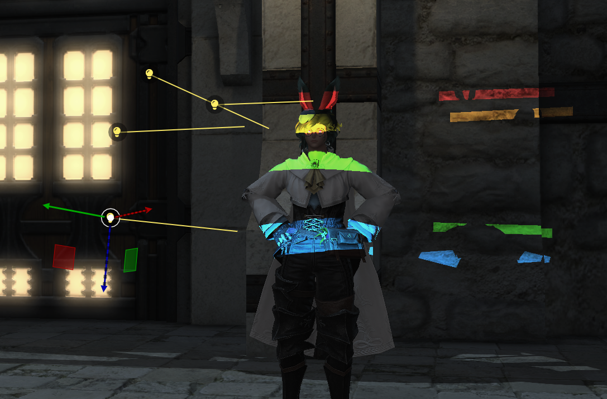
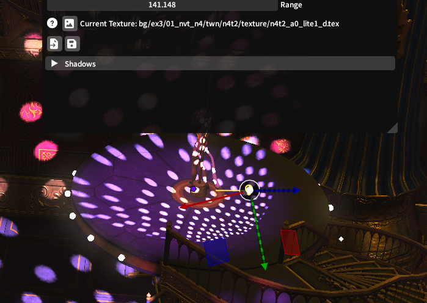

# Scene Composition

Ktisis now has multiple ways to edit a GPose scene besides just the actors inside it and their poses!

## Environment Editing

Vanilla GPoses are constrained by all kinds of factors from the overworld environment: the time of day, the weather and its visual effects, the stars in the skybox, and so on. The **Environment Editor** lets you modify just about anything!

{ align=left width=400 }

Beyond just freezing time like with the vanilla controls, you can set a specific time to position the sun and moon in the sky, creating new light angles or turning on some night-lights in the overworld.

Weather patterns can also be chosen based on those available in any given zone - the _Mist_ housing district can be made foggy or snowy on demand, and the _South Shroud_ can be given its **Tension** weather from the unique Odin fate.

The Advanced options for the Environment Editor offer even more granular control, letting you create scenes and overworld conditions that could never exist in vanilla gameplay.

### Sky, Stars, Light

The **Sky** editor lets you choose custom skyboxes and cloudboxes that surround the edges of the map - many of these are pulled from unique areas, giving a lot of control over making unique or abstract skylines behind the focus of your photos.

The **Stars** editor controls another skybox layer for the starry constellations, typically only visible at night. These can be made brighter and darker, same with the moon and planets and galaxies included too!

Similarly, the **Light** editor controls different effects related to sun and moonlight in the zone - want things to look dim and blue in the daytime or blazing like Dalamud at night? Just swap around the sun and moon colors, or change other values related to the color and lighting the environment naturally has.

{ width=600 }
/// caption
Setting a bright red skybox and moonlight color at night, plus increasing the density of stars
/// 

### Fog, Rain, and Particles

**Fog** and **Rain** can be controlled via their editors regardless of the current weather in the zone - make things rainy in the daytime or smoggy in a desert! You can effect the density of both, as well as the color and distances they appear from.

{ width=600 }
/// caption
Rain falls sideways like lines through hyperspace, over an ominously foggy gray skyline
/// 

**Particles** offer even more granular and fantastical possibilities for environmental effects in your GPose. Certain zones include these as ambient effects that float around the screen - during the South Shroud **Tension** weather, glowing green motes fly upwards, but during other weathers, leaf-like specks float downwards from the trees.

These particles can be edited where they already exist, or added where they don't - combining a basic texture with size, density, and color controls can lead to very cool outcomes!

{ width=600 }
/// caption
Transluscent blue petals fill the screen with Texture #3 in use
/// 

### Wind, Water, and Housing

**Wind** controls (speed, angle, and direction) can affect particles too, as well as how the breeze moves the environment's trees, grass, and even player hair or sleeve physics.

**Water** options are useful near rivers and beaches, letting you pause or scrub the flow of water on 4 different controllers depending on the body of water and layered texture in question.

Finally, when inside player housing, the **Housing** menu can adjust the strength of the interior lighting (so you can turn it up or down if you're posing in someone else's home) or toggle the SSAO shadow effects present on certain furniture.

## Light Editing

Vanilla GPosing only offers 3 light sources to turn on, with their controls unhelpfully labeled Types 1 through 3 and a basic RGB coloring made available. Ktisis offers more granular control of these lights, plus the ability to spawn as many lights in a scene as you wish with all-new characteristics and capabilities to them.

### Creation (and Saving)

Lights can either be spawned using the 3 buttons in the vanilla interface _or_ from Ktisis' Workspace window. Either method of creation will spawn a new light source at the current camera (or work camera) position. Customizations for individual lights can be saved and loaded by use of `.ktlight` files, letting you keep certain presets handy for future poses no matter the location.

{ align=right width=400 }

They can also be turned on and off directly from the Workspace, or made visible in the 3D overlay to be posed around like an actor's bones.

### Light Types

4 types of lights exist in vanilla XIV that Ktisis can take advantage of:

#### Point Lights

These are your typical, everyday GPose lights. From one location, they project their color and intensity of light equally in all directions. They can be great for filling out the color of a scene or shining a light on otherwise-shadowy environments.

#### Directional Lights

Directional lights have the power of the sun! Creating one can be blinding at first, but these cast intense and high-contrast light in a single direction, acting the same as the sun in the sky but placeable wherever you wish. They'll even effect glare and cascading light effects across the ocean or bodies of water.

#### Spot Lights

Spotlights act exactly how you'd expect. From one point, they project a cone of light onto actors and surfaces, with options available to adjust the angle and falloff of this light when in use. These can put a dramatic focus on an actor like in a stage play, or can be broadened and diffused down to a pleasantly hazy look over a larger area.

#### Area Lights

Area lights act much like spotlights, but with additional control over the shape they form. Rather than a cone projection, these start out as square boxes of light - different angle and panning options let you widen and shorten these, allowing you to cast unique shadows or slats of light where necessary.

### Options

Beyond light-specific behaviors like were detailed above, each light in Ktisis can have its color, intensity, distance, and even its shadows' effects controlled. Shadows can be made to apply to (or ignore) characters and objects in the scene - while lights themselves can be modified to be brighter or dimmer, softer or harsher, just about any way you can imagine!

We recommend playing with all the available settings for lighting in the **Object Editor**, and reading up on real-life lighting techniques can help here too! Our guides section includes multiple tutorials on lighting scenes with Ktisis, so please browse them or ask for help if you're looking to accomplish something specific.

{ width=600 }
/// caption
///

#### Gobos
Spotlights and Area Lights support gobo textures, currently a set of 80+ vanilla images that can be projected over the light source. These textures can create interesting silhouettes and color effects when combined with other light settings!

## World Editing
Using Ktisis v0.4, nearly any object in the overworld can be picked from its surroundings and manipulated as though it were an actor or prop in your GPose scene. These objects can be selected from the World Overlay in the Workspace window, then hidden or dragged in your scene to any place or size you wish. Light sources and PC/NPC actors can be added this way, too!

{ width=600 }
/// caption
Ktisis being used to select and manipulate disco-light from Eulmore's Beehive
///
